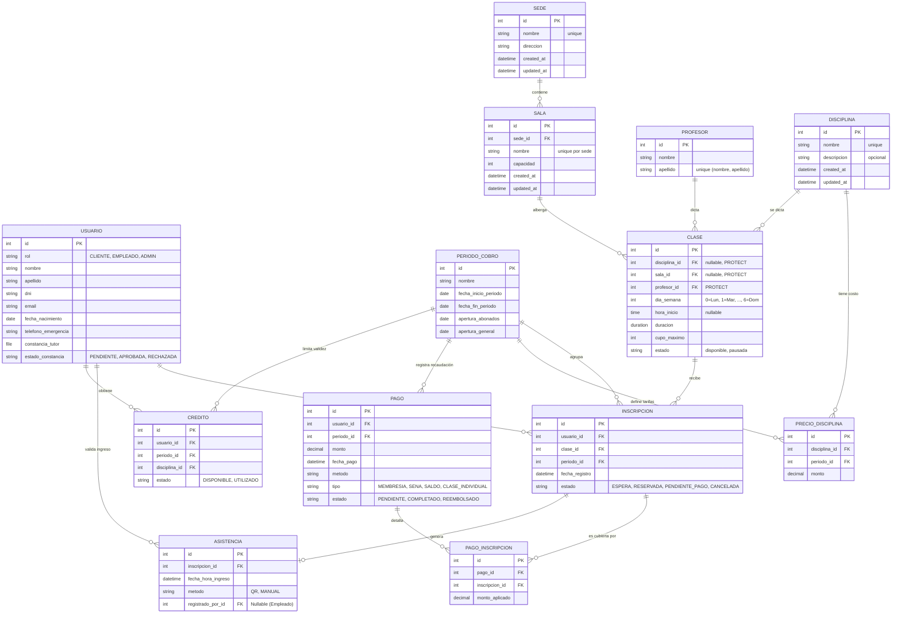

# Arquitectura

## Software Stack

- **Backend:** Django 6
- **Task Queue:** Django Q
- **Frontend CSS:** Tailwind CSS
- **Frontend Interactivity:** HTMX
- **Frontend State/UI:** Alpine.js
- **Base de datos:** PostgreSQL

## Estructura del proyecto

- `pyproject.toml`: Configuración del proyecto que utiliza `uv` para determinar la versión de python y las dependencias.
- `GYMFlow/`: Tiene la configuración del proyecto y las URL que apuntan a vistas.
  - `settings.py`: Tiene toda la configuración del proyecto django.
  - `urls.py`: Mapea vistas de django a urls.
- `static/`: Assets estáticos como css, js. Se sirve como están allí.
  - `base.html`: Las librerías JS (HTMX, Alpine.js, Tailwind) se cargan vía CDN aquí.
  - `partials`: Los partials de Django son bloques de codigo reutilizables. Permiten utilizar componentes HTML pasando parámetros desde otros archivos HTML. Parecido a React.
- `templates/`: Los templates de Django son los archivos HTML que se renderizan en las vistas.

Los módulos (Django Apps) se encuentran en el directorio `apps/`:

- `users/`: Módulo de autenticación y gestión de usuarios. Registros, asignación de roles y desarrollo del MFA para administradores.
- `classes/`: Módulo de gestión de clases e inscripciones. Configuración de las disciplinas, con sus horarios, profesores y lista de espera. Control de apertura/cierre de inscripciones según el calendario.
- `payments/`: Módulo de gestion de cobros. Integración con MercadoPago para cobros. Gestión de los créditos por cancelaciones anticipadas y registro de pagos en efectivo en recepción.
- `attendance/`: Módulo de asistencia. Generación/lectura de códigos QR y carga de constancias de tutores para menores de edad.
- `reports/`: Módulo de panel de administrador para visualizar los ingresos, cancelaciones, la concurrencia y más.
- `notifications/` Módulo de notificaciones. Envío de correos para la confirmación de cupos y recordatorios de clases.

Para cada módulo, dentro de `templates/` y un directorio de su propio nombre, se encuentran los archivos HTML que se renderizan en las vistas.

## Esquema de la base de datos

En la implementación el esquema se encuentra distribuido en el archivo `models.py` del módulo que corresponda. Django viene con un [ORM](https://en.wikipedia.org/wiki/Object%E2%80%93relational_mapping) y realiza las migraciones a nuestra BD Postgres, de ser necesario ver [Django migrations](https://docs.djangoproject.com/en/6.0/topics/migrations/).

